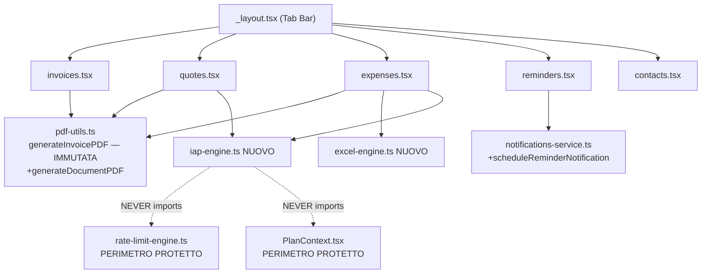

# Design Tecnico — VELA Pivot Prodotto

## Overview

VELA evolve da generatore di fatture PDF a **quaderno del professionista**: una suite mobile (React Native/Expo) che affianca alla sezione Fatture esistente quattro nuove sezioni (Preventivi, Note spese, Promemoria scadenze, Rubrica clienti). La monetizzazione migra da abbonamento freemium con rate-limit quantitativi a **IAP one-time** su feature specifiche, eliminando ogni forma di contatore o blocco sulla creazione di documenti.

### Principi guida del design

1. **Perimetro protetto**: `Rate_Limit_Engine`, `PlanContext`, `organizations.plan`, `user_plan.plan` restano invariati.
2. **Retrocompatibilità zero-regression**: `generateInvoicePDF` e `shareInvoicePDF` non vengono mai toccati; si aggiunge un nuovo entry-point sopra di essi.
3. **Nessun rate-limit**: nessun contatore, flag, cooldown o blocco di qualsiasi tipo sulle cinque sezioni.
4. **IAP Module indipendente**: la gestione entitlement RevenueCat vive in `lib/iap-engine.ts`, mai sovrapposto a `rate-limit-engine.ts`.
5. **Snapshot cliente**: i dati di un cliente vengono copiati nel documento al momento della creazione; l'eliminazione del cliente dalla Rubrica non altera i documenti esistenti.

### Ricerca e contesto tecnico

**react-native-purchases (RevenueCat SDK)** è già presente in `package.json` alla versione `10.2.1`. Il progetto è quindi già predisposto per RevenueCat — non serve installare nulla di nuovo per il modulo IAP.

**`xlsx` (SheetJS CE)** non è presente tra le dipendenze. Andrà aggiunto: `"xlsx": "0.18.5"` (versione pinned, compatibile con Metro bundler tramite polyfill `stream-browserify`).

**`expo-notifications`** è già presente alla versione `~0.31.0`. Il `Notification_Service` esistente gestisce già permessi e scheduling — si aggiungono solo le funzioni specifiche per i promemoria.

**Strategia tabella `contacts`**: la tabella `clients` esistente ha già `name`, `email`, `phone`, `address`, `taxId` (`tax_id`), `currency`. La Rubrica riutilizza `clients` senza rinominarla — il tab `contacts.tsx` è un wrapper che legge dalla stessa tabella. Questo evita breaking change a qualsiasi route o API esistente.

---

## Architecture

### Struttura file — modifiche e aggiunte

```
app/
  (app)/
    (tabs)/
      _layout.tsx          ← MODIFICA: +expenses, +reminders, +contacts tab
      index.tsx            (invariata)
      invoices.tsx         (invariata)
      quotes.tsx           (invariata — già presente)
      expenses.tsx         ← NUOVO
      reminders.tsx        ← NUOVO
      contacts.tsx         ← NUOVO (wrapper di clients.tsx)
      settings.tsx         (invariata)
      clients.tsx          (invariata — continua a esistere, non modificata)
    invoices/
      new.tsx, [invoice].tsx  (invariati)
    quotes/
      new.tsx, [id].tsx    (invariati)
    expenses/
      new.tsx              ← NUOVO
      [id].tsx             ← NUOVO
    reminders/
      new.tsx              ← NUOVO
      [id].tsx             ← NUOVO

lib/
  pdf-utils.ts             ← MODIFICA ADDITIVA: +generateDocumentPDF, +QuoteData, +ExpenseReportData
  iap-engine.ts            ← NUOVO (zero dipendenze da rate-limit-engine.ts)
  excel-engine.ts          ← NUOVO
  notifications-service.ts ← MODIFICA ADDITIVA: +scheduleReminderNotification, +cancelReminderNotification, +requestNotificationPermission, +hasNotificationPermission

components/
  IAPPaywall.tsx           ← NUOVO

supabase/migrations/
  ..._pivot_quotes.sql     ← NUOVO
  ..._pivot_expenses.sql   ← NUOVO
  ..._pivot_reminders.sql  ← NUOVO
  ..._pivot_contacts.sql   ← NUOVO (solo ALTER TABLE clients ADD COLUMN IF NOT EXISTS)
```

### Diagramma di dipendenze dei moduli



**Regola di dipendenza critica**: `iap-engine.ts` non deve contenere nessun `import` da `rate-limit-engine.ts`, `PlanContext.tsx`, o da qualsiasi modulo che li re-esporta. Il linting CI può verificarlo automaticamente.

---

## Components and Interfaces

### 1. Tab Bar — `app/(app)/(tabs)/_layout.tsx`

Il layout attuale ha 5 tab: Dashboard, Fatture, Preventivi, Clienti, Impostazioni. Il pivot espande a 7 tab mantenendo tutti gli stili esistenti:

| # | Nome tab | Route `name` | Icona Ionicons | i18n key |
|---|----------|-------------|----------------|----------|
| 1 | Dashboard | `index` | `stats-chart` | `dashboard` |
| 2 | Fatture | `invoices` | `document-text` | `invoices` |
| 3 | Preventivi | `quotes` | `document-text-outline` / `document-text` | `quotes` |
| 4 | Note spese | `expenses` | `receipt-outline` / `receipt` | `tabs.expenses.title` |
| 5 | Promemoria | `reminders` | `alarm-outline` / `alarm` | `tabs.reminders.title` |
| 6 | Rubrica | `contacts` | `people-outline` / `people` | `tabs.contacts.title` |
| 7 | Impostazioni | `settings` | `settings` | `settings` |

Il tab `clients` esistente viene **nascosto** dalla Tab Bar (usando `href: null` in `tabBarButton`) ma la route rimane attiva per retrocompatibilità. Il tab `contacts` è il punto di ingresso visibile per la stessa logica.

**Pattern di aggiunta tab** (segue stile esistente):

```tsx
<Tabs.Screen
  name="expenses"
  options={{
    title: t("tabs.expenses.title"),
    tabBarIcon: ({ color, size, focused }) => (
      <Ionicons name={focused ? 'receipt' : 'receipt-outline'} size={size} color={color} />
    ),
  }}
/>
<Tabs.Screen
  name="reminders"
  options={{
    title: t("tabs.reminders.title"),
    tabBarIcon: ({ color, size, focused }) => (
      <Ionicons name={focused ? 'alarm' : 'alarm-outline'} size={size} color={color} />
    ),
  }}
/>
<Tabs.Screen
  name="contacts"
  options={{
    title: t("tabs.contacts.title"),
    tabBarIcon: ({ color, size, focused }) => (
      <Ionicons name={focused ? 'people' : 'people-outline'} size={size} color={color} />
    ),
  }}
/>
<Tabs.Screen
  name="clients"
  options={{ href: null }}  // nascosto dalla Tab Bar, route attiva
/>
```

### 2. PDF_Engine — `lib/pdf-utils.ts` (modifica additiva)

Il file **non subisce nessuna modifica alle funzioni esistenti**. `generateInvoicePDF` e `shareInvoicePDF` restano inalterati nel corpo, nella firma e nel comportamento. Si aggiungono esclusivamente nuovi tipi e la nuova funzione `generateDocumentPDF`.

**Strategia di retrocompatibilità**: `generateDocumentPDF` con `documentType: 'invoice'` ha una propria implementazione HTML che replica fedelmente `generateInvoicePDF`. Non chiama `generateInvoicePDF` internamente — questo evita qualsiasi rischio di regressione indiretta. I test di Property 1 garantiscono l'equivalenza degli output.

```typescript
// Aggiunte a lib/pdf-utils.ts — NON modificano nulla di esistente

export type DocumentType = 'invoice' | 'quote' | 'expense_report';

export interface ClientSnapshot {
  id: string;
  name: string;
  email?: string;
  phone?: string;
  address?: string;
  taxId?: string;
  currency: string;
}

export interface QuoteData {
  id: string;
  quoteNumber: string;
  clientSnapshot: ClientSnapshot;
  status: 'draft' | 'sent' | 'accepted' | 'rejected' | 'invoiced';
  issueDate: Date;
  validUntil: Date;           // campo specifico preventivo
  lineItems: LineItem[];
  subtotal: number;
  taxRate: number;
  taxAmount: number;
  discountAmount: number;
  total: number;
  notes?: string;
  templateId?: string;
}

export interface ExpenseItem {
  id: string;
  date: Date;
  category: string;
  amount: number;
  currency: string;
  description?: string;
}

export interface ExpenseReportData {
  id: string;
  reportNumber: string;
  title: string;
  period: { from: Date; to: Date };
  items: ExpenseItem[];
  totalByCategory: Record<string, number>;
  grandTotal: number;
  currency: string;
}

export type DocumentData = Invoice | QuoteData | ExpenseReportData;

// PDFGenerationOptions estesa (aggiunta parametri opzionali — non breaking)
// Il tipo esistente va aggiornato aggiungendo i due campi opzionali sotto.
// ATTENZIONE: i campi già presenti (includeQRCode, logoUrl, companyName,
//             companyEmail, companyPhone, companyAddress) non vengono toccati.
export interface PDFGenerationOptionsExtended extends PDFGenerationOptions {
  documentType?: DocumentType;  // default: 'invoice' se omesso
  templateId?: string;
}

/**
 * Nuovo entry-point unificato — NON modifica generateInvoicePDF.
 * Con documentType='invoice' produce HTML equivalente a generateInvoicePDF.
 */
export async function generateDocumentPDF(
  data: DocumentData,
  options: PDFGenerationOptionsExtended & { documentType: DocumentType }
): Promise<string | null>
```

**Comportamento per documentType**:

| `documentType` | Header documento | Campo data 2 | Struttura corpo |
|---|---|---|---|
| `'invoice'` | `FATTURA` / `INVOICE` | `Scadenza: <dueDate>` | Tabella voci + totali (identica a esistente) |
| `'quote'` | `PREVENTIVO` | `Valido fino al: <validUntil>` | Tabella voci + totali (stessa struttura invoice) |
| `'expense_report'` | `NOTA SPESE` | `Periodo: <from> – <to>` | Tabella voci con colonne Data/Categoria/Importo/Descrizione + subtotali per categoria + totale complessivo |

### 3. IAP Module — `lib/iap-engine.ts` (nuovo)

Modulo completamente separato da `rate-limit-engine.ts` e da `PlanContext`. Non importa mai nessuno dei due. Gestisce esclusivamente gli entitlement RevenueCat per i 4 IAP one-time.

**Nota importante**: i Product_ID (`vela.template.premium`, `vela.logo.custom`, `vela.export.excel`, `vela.backup.cloud`) devono essere creati su Play Console e registrati su RevenueCat **prima** di essere referenziati nel codice. Il modulo va deployato solo dopo questa operazione (Req 9.2).

```typescript
// lib/iap-engine.ts

import Purchases, { PurchasesEntitlementInfo } from 'react-native-purchases';
import AsyncStorage from '@react-native-async-storage/async-storage';

// Product_ID: referenziati solo dopo creazione su Play Console/RevenueCat (Req 9.2)
export type IAPProductId =
  | 'vela.template.premium'
  | 'vela.logo.custom'
  | 'vela.export.excel'
  | 'vela.backup.cloud';

export interface EntitlementState {
  productId: IAPProductId;
  isActive: boolean;
  purchaseDate?: Date;
  cachedAt: number;  // timestamp ms
}

export interface IAPEngineState {
  entitlements: Record<IAPProductId, EntitlementState>;
  isLoading: boolean;
  lastSyncAt: number | null;
  networkError: boolean;
}

const IAP_CACHE_KEY = 'vela_iap_entitlements_v1';
const CACHE_TTL_MS = 24 * 60 * 60 * 1000; // 24h

/**
 * Recupera lo stato entitlement da RevenueCat.
 * In caso di errore di rete, ritorna la cache locale (graceful degradation, Req 9.6).
 */
export async function fetchEntitlements(
  options?: { onNetworkError?: () => void }
): Promise<IAPEngineState>

/**
 * Verifica se un singolo entitlement è attivo.
 * Cache-first: usa cache locale se RevenueCat non è raggiungibile.
 */
export async function checkEntitlement(
  productId: IAPProductId
): Promise<boolean>

/**
 * Avvia il flusso di acquisto RevenueCat per un Product_ID.
 * Aggiorna immediatamente la cache locale dopo acquisto completato (Req 9.3).
 */
export async function purchaseProduct(
  productId: IAPProductId
): Promise<EntitlementState>

/**
 * Ripristina gli acquisti esistenti (Req 9.5).
 */
export async function restorePurchases(): Promise<IAPEngineState>

export async function syncEntitlementsToCache(state: IAPEngineState): Promise<void>
export async function readEntitlementsFromCache(): Promise<IAPEngineState | null>
```

**Cache offline** (Req 9.6): se `Purchases.getCustomerInfo()` lancia un'eccezione di rete, si legge la cache AsyncStorage. Se la cache è assente, tutti gli entitlement sono considerati inattivi (pessimistic fallback). Un banner non bloccante informa l'utente.

### 4. Excel Engine — `lib/excel-engine.ts` (nuovo)

```typescript
// lib/excel-engine.ts
import * as XLSX from 'xlsx';            // SheetJS CE, versione pinned 0.18.5
import * as FileSystem from 'expo-file-system';
import * as Sharing from 'expo-sharing';

export interface XLSXGenerationOptions {
  filename?: string;
  sheetName?: string;
  currency?: string;
}

/**
 * Genera un file .xlsx per una o più note spese.
 * Il chiamante DEVE verificare l'entitlement vela.export.excel prima di invocare.
 * @returns path assoluto del file .xlsx generato
 */
export async function generateExpenseXLSX(
  reports: ExpenseReportData[],
  options?: XLSXGenerationOptions
): Promise<string>

/**
 * Condivide il file .xlsx via sharing nativo.
 * Se Sharing.shareAsync fallisce, copia in documentDirectory (fallback, Req 5.6).
 */
export async function shareExpenseXLSX(
  filepath: string,
  filename: string
): Promise<{ shared: boolean; fallbackPath?: string }>
```

**Struttura foglio .xlsx**:
- Riga 1: intestazione `Data | Categoria | Importo | Valuta | Descrizione`
- Righe 2..N+1: una riga per `ExpenseItem`
- Riga N+2+: subtotale per categoria (riga per ogni categoria distinta)
- Ultima riga: totale complessivo (bold via stile cella)

**Dipendenza**: aggiungere `"xlsx": "0.18.5"` a `package.json`. SheetJS CE non richiede moduli nativi — funziona tramite JS puro con Metro bundler.

### 5. Notification Service — `lib/notifications-service.ts` (modifica additiva)

Le funzioni esistenti non vengono modificate. Si aggiungono i tipi e le funzioni specifiche per la sezione Promemoria. Il `NotificationType` esistente viene esteso con `'deadline_reminder'`.

```typescript
// Aggiunta al NotificationType esistente
export type NotificationType =
  | 'payment_received' | 'invoice_sent' | 'invoice_overdue'
  | 'payment_reminder' | 'invoice_viewed'
  | 'deadline_reminder';  // NUOVO per sezione Promemoria

export interface Reminder {
  id: string;
  title: string;
  notes?: string;
  dueDate: Date;
  recurrence: 'once' | 'monthly' | 'yearly';
  notificationId?: string;
}

/**
 * NUOVA — Schedula una notifica push locale per un promemoria (Req 6.3).
 * Trigger = reminder.dueDate. Content.title = reminder.title.
 * @returns notificationId schedulato, o null se i permessi non sono concessi
 */
export async function scheduleReminderNotification(
  reminder: Reminder
): Promise<string | null>

/**
 * NUOVA — Cancella la notifica schedulata per un promemoria.
 */
export async function cancelReminderNotification(
  reminderId: string
): Promise<void>

/**
 * NUOVA — Richiede permesso notifiche al primo accesso alla sezione Promemoria (Req 6.5).
 * @returns true se il permesso è stato concesso
 */
export async function requestNotificationPermission(): Promise<boolean>

/**
 * NUOVA — Controlla se i permessi notifiche sono già concessi.
 */
export async function hasNotificationPermission(): Promise<boolean>
```

**Flusso al primo accesso alla sezione Promemoria**:
1. `hasNotificationPermission()` → se `false`, chiama `requestNotificationPermission()`
2. Se l'utente nega → mostra Alert in-app con istruzioni per impostazioni dispositivo (Req 6.6)
3. La creazione del promemoria procede indipendentemente dall'esito del permesso — la notifica non verrà schedulata finché il permesso non viene concesso

**Gestione ricorrenza**: per `recurrence === 'monthly'` o `'yearly'`, il promemoria genera una nuova notifica alla data successiva al completamento. La logica di rescheduling è responsabilità della sezione Reminders, non del Notification Service.

### 6. IAP Paywall Component — `components/IAPPaywall.tsx` (nuovo)

Componente riutilizzabile dai 4 contesti di paywall. Completamente scollegato da `PlanContext` e `Rate_Limit_Engine`.

```typescript
export interface IAPPaywallProps {
  productId: IAPProductId;
  featureName: string;           // es. "Export Excel"
  featureDescription: string;    // copy contestuale
  onPurchaseSuccess: () => void;
  onDismiss: () => void;
}
```

Il componente gestisce internamente: caricamento prezzo da RevenueCat, flusso di acquisto, flusso di ripristino acquisti, gestione errori.

### 7. ClientSnapshot — meccanismo snapshot al momento della creazione

**Problema**: eliminare un cliente dalla Rubrica non deve alterare i documenti esistenti (Req 7.6).

**Soluzione**: al momento della creazione di ogni documento (`quotes`, `expenses`), i dati del cliente vengono copiati come JSONB `client_snapshot`. Le query di visualizzazione leggono `client_snapshot`, non la tabella `clients`. La FK `client_id` può diventare `NULL` per `ON DELETE SET NULL` senza rompere la visualizzazione.

```typescript
export interface ClientSnapshot {
  id: string;       // id originale (solo riferimento, non FK constraint)
  name: string;
  email?: string;
  phone?: string;
  address?: string;
  taxId?: string;
  currency: string;
}
```

**Pattern di creazione documento con snapshot**:
```typescript
const snapshot: ClientSnapshot = {
  id: client.id,
  name: client.name,
  email: client.email,
  phone: client.phone,
  address: client.address,
  taxId: client.tax_id,
  currency: client.default_currency ?? 'EUR',
};
// snapshot viene salvato nel documento — il client può essere eliminato in sicurezza
```

### 8. Pivot Naming — strategia i18n

**Occorrenze da aggiornare** (naming prodotto — "fattura" come sinonimo dell'app intera):

| File | Chiave | Valore attuale da aggiornare |
|------|--------|------------------------------|
| `it.ts` | `modal.pro_upgrade.subtitle` | "Fatture illimitate, invio email/PDF..." → rimuovere "Fatture illimitate" come unico beneficio |
| `it.ts` | `modal.pro_upgrade.feature.unlimited` | "Fatture illimitate" → "Documenti illimitati" |
| `it.ts` | `login.subtitle` | (se contiene riferimento a fatture come prodotto) |
| `it.ts` | `tabs.dashboard.onboarding.title` | "Inizia con VELA" ✓ già corretto |
| Tutti `*.ts` | Testi onboarding che usano "fattura/e" come sinonimo di VELA | → "VELA", "documento", o nome sezione |

**Occorrenze da mantenere** (naming sezione — "fattura/e" si riferisce correttamente a Fatture):

| File | Chiave | Motivo di mantenimento |
|------|--------|------------------------|
| `it.ts` | `newInvoice`, `tabs.invoices.*` | Nome corretto della sezione Fatture |
| `it.ts` | `tabs.invoices.empty.default.*` | Sezione Fatture specifica |
| `it.ts` | `milestone.first_invoice.*` | Milestone della sezione Fatture |
| `it.ts` | `invoice_*` (form, alerts) | Form specifici della sezione Fatture |

**Nuove chiavi i18n da aggiungere** a tutti i file locale:

```typescript
// Da aggiungere in tutti lib/locales/*.ts
"tabs.expenses.title": "Note spese",       // it
"tabs.reminders.title": "Promemoria",      // it
"tabs.contacts.title": "Rubrica",          // it
"tabs.expenses.empty.title": "...",
"tabs.expenses.empty.hint": "...",
"tabs.expenses.empty.cta": "Nuova nota spese",
"tabs.reminders.empty.title": "...",
"tabs.reminders.empty.hint": "...",
"tabs.reminders.empty.cta": "Nuovo promemoria",
"tabs.contacts.empty.title": "...",
"tabs.contacts.empty.cta": "Aggiungi cliente",
// IAP Paywall
"iap.excel.name": "Export Excel",
"iap.excel.description": "Esporta le note spese in formato .xlsx per il tuo commercialista.",
"iap.template.name": "Template Premium",
"iap.logo.name": "Logo Personalizzato",
"iap.backup.name": "Backup Cloud",
// Notification permission
"reminders.notification.permission_denied_title": "Notifiche disabilitate",
"reminders.notification.permission_denied_msg": "Vai in Impostazioni > Notifiche > VELA per abilitarle.",
```

---

## Data Models

### Schema Supabase — Nuove Tabelle

#### Tabella `quotes`

```sql
CREATE TABLE IF NOT EXISTS public.quotes (
  id               UUID          PRIMARY KEY DEFAULT gen_random_uuid(),
  org_id           UUID          NOT NULL REFERENCES public.organizations(id) ON DELETE CASCADE,
  quote_number     TEXT          NOT NULL,
  status           TEXT          NOT NULL DEFAULT 'draft'
                                 CHECK (status IN ('draft', 'sent', 'accepted', 'rejected', 'invoiced')),
  issue_date       DATE          NOT NULL DEFAULT CURRENT_DATE,
  valid_until      DATE          NOT NULL,
  client_id        UUID          REFERENCES public.clients(id) ON DELETE SET NULL,
  client_snapshot  JSONB         NOT NULL,
  line_items       JSONB         NOT NULL DEFAULT '[]',
  subtotal         NUMERIC(12,2) NOT NULL DEFAULT 0,
  tax_rate         NUMERIC(5,2)  NOT NULL DEFAULT 0,
  tax_amount       NUMERIC(12,2) NOT NULL DEFAULT 0,
  discount_amount  NUMERIC(12,2) NOT NULL DEFAULT 0,
  total            NUMERIC(12,2) NOT NULL DEFAULT 0,
  notes            TEXT,
  template_id      TEXT,
  converted_to_invoice_id UUID REFERENCES public.invoices(id) ON DELETE SET NULL,
  created_at       TIMESTAMPTZ   NOT NULL DEFAULT NOW(),
  updated_at       TIMESTAMPTZ   NOT NULL DEFAULT NOW()
);
CREATE INDEX IF NOT EXISTS idx_quotes_org ON public.quotes(org_id);
```

*Nota*: `client_id` referenzia `public.clients` (tabella esistente), non `contacts`. La Rubrica è la stessa tabella `clients`.

#### Tabella `expenses`

```sql
CREATE TABLE IF NOT EXISTS public.expenses (
  id               UUID          PRIMARY KEY DEFAULT gen_random_uuid(),
  org_id           UUID          NOT NULL REFERENCES public.organizations(id) ON DELETE CASCADE,
  report_number    TEXT          NOT NULL,
  title            TEXT          NOT NULL,
  period_from      DATE          NOT NULL,
  period_to        DATE          NOT NULL,
  items            JSONB         NOT NULL DEFAULT '[]',
  total_by_category JSONB        NOT NULL DEFAULT '{}',
  grand_total      NUMERIC(12,2) NOT NULL DEFAULT 0,
  currency         TEXT          NOT NULL DEFAULT 'EUR',
  created_at       TIMESTAMPTZ   NOT NULL DEFAULT NOW(),
  updated_at       TIMESTAMPTZ   NOT NULL DEFAULT NOW()
);
CREATE INDEX IF NOT EXISTS idx_expenses_org ON public.expenses(org_id);
```

#### Tabella `reminders`

```sql
CREATE TABLE IF NOT EXISTS public.reminders (
  id               UUID        PRIMARY KEY DEFAULT gen_random_uuid(),
  org_id           UUID        NOT NULL REFERENCES public.organizations(id) ON DELETE CASCADE,
  title            TEXT        NOT NULL,
  notes            TEXT,
  due_date         TIMESTAMPTZ NOT NULL,
  recurrence       TEXT        NOT NULL DEFAULT 'once'
                               CHECK (recurrence IN ('once', 'monthly', 'yearly')),
  notification_id  TEXT,
  completed        BOOLEAN     NOT NULL DEFAULT false,
  created_at       TIMESTAMPTZ NOT NULL DEFAULT NOW(),
  updated_at       TIMESTAMPTZ NOT NULL DEFAULT NOW()
);
CREATE INDEX IF NOT EXISTS idx_reminders_org ON public.reminders(org_id);
```

#### Tabella `clients` — aggiornamenti additivi (Rubrica)

```sql
-- Migration: pivot_contacts.sql
-- Solo aggiunta colonne mancanti — nessuna modifica a colonne esistenti
ALTER TABLE public.clients ADD COLUMN IF NOT EXISTS phone TEXT;
ALTER TABLE public.clients ADD COLUMN IF NOT EXISTS tax_id TEXT;
ALTER TABLE public.clients ADD COLUMN IF NOT EXISTS default_currency TEXT DEFAULT 'EUR';
```

Il tab `contacts.tsx` legge dalla tabella `clients` invariata. Nessuna rinomina, nessuna view aggiuntiva.

#### RLS Policy (pattern comune per tutte le nuove tabelle)

```sql
ALTER TABLE public.quotes ENABLE ROW LEVEL SECURITY;
DO $$ BEGIN
  CREATE POLICY "quotes_org_owner" ON public.quotes FOR ALL
  USING (org_id = (
    SELECT om.org_id FROM public.org_members om
    WHERE om.user_id = auth.uid() AND om.role = 'owner' LIMIT 1
  ));
EXCEPTION WHEN duplicate_object THEN NULL; END $$;
-- Stesso pattern per expenses e reminders
```

Vincolo critico: **nessuna modifica** a `public.organizations` (colonna `plan`) né a `public.user_plan` (colonna `plan`) nelle migrazioni pivot.

#### updated_at trigger (riutilizza funzione esistente)

```sql
-- Riutilizza public.update_updated_at() già creata in migration 001
CREATE TRIGGER trg_quotes_updated_at
  BEFORE UPDATE ON public.quotes
  FOR EACH ROW EXECUTE FUNCTION public.update_updated_at();
-- Idem per expenses e reminders
```

### TypeScript — Tipi condivisi (aggiunte a `shared/types.ts`)

I tipi `Invoice`, `Client`, `LineItem`, `InvoiceStatus` e tutti gli esistenti **non vengono modificati**.

```typescript
// Aggiunte a shared/types.ts

export type QuoteStatus = 'draft' | 'sent' | 'accepted' | 'rejected' | 'invoiced';
export type ReminderRecurrence = 'once' | 'monthly' | 'yearly';

export interface ClientSnapshot {
  id: string;
  name: string;
  email?: string;
  phone?: string;
  address?: string;
  taxId?: string;
  currency: string;
}

export interface Quote {
  id: string;
  quoteNumber: string;
  status: QuoteStatus;
  issueDate: Date;
  validUntil: Date;
  clientId?: string;
  clientSnapshot: ClientSnapshot;
  lineItems: LineItem[];  // riusa LineItem esistente
  subtotal: number;
  taxRate: number;
  taxAmount: number;
  discountAmount: number;
  total: number;
  notes?: string;
  templateId?: string;
  convertedToInvoiceId?: string;
  createdAt: Date;
  updatedAt: Date;
}

export interface ExpenseItem {
  id: string;
  date: Date;
  category: string;
  amount: number;
  currency: string;
  description?: string;
}

export interface ExpenseReport {
  id: string;
  reportNumber: string;
  title: string;
  periodFrom: Date;
  periodTo: Date;
  items: ExpenseItem[];
  totalByCategory: Record<string, number>;
  grandTotal: number;
  currency: string;
  createdAt: Date;
  updatedAt: Date;
}

export interface Reminder {
  id: string;
  title: string;
  notes?: string;
  dueDate: Date;
  recurrence: ReminderRecurrence;
  notificationId?: string;
  completed: boolean;
  createdAt: Date;
  updatedAt: Date;
}
```

---

## Correctness Properties

*Una property è una caratteristica o comportamento che deve valere per tutte le esecuzioni valide di un sistema — essenzialmente, una dichiarazione formale di ciò che il sistema deve fare. Le properties servono come ponte tra specifiche leggibili dall'uomo e garanzie di correttezza verificabili automaticamente.*

**Property Reflection**: dopo il prework, le properties 14.4 e 14.5 e 14.6 dei requisiti sono logicamente sussumibili dalla P1, P2 e P3 rispettivamente. Le properties redundanti sono state eliminate. Le restanti properties coprono tutte le acceptance criteria classificate come PROPERTY nel prework.

### Property 1: Retrocompatibilità PDF_Engine — invoice round-trip

*Per qualsiasi* oggetto `Invoice` valido (con `invoiceNumber`, `total`, `lineItems` non vuoto) e qualsiasi `Client` opzionale, chiamare `generateDocumentPDF(invoice, { documentType: 'invoice' })` deve produrre una stringa HTML non nulla e non vuota in cui sono presenti: il valore `invoice.invoiceNumber`, la stringa formattata di `invoice.total`, e il nome del cliente (se fornito) — gli stessi campi chiave prodotti da `generateInvoicePDF(invoice, client)`.

**Validates: Requirements 3.2, 3.3, 14.4**

### Property 2: Quote PDF contiene header e campo obbligatori

*Per qualsiasi* `QuoteData` valida (con `quoteNumber` non vuoto, `validUntil` valida, `lineItems` non vuoto), l'HTML generato da `generateDocumentPDF(data, { documentType: 'quote' })` deve contenere la stringa `"PREVENTIVO"` come intestazione del documento E la stringa `"Valido fino al"` come etichetta del campo data, e NON deve contenere la stringa `"FATTURA"` come intestazione.

**Validates: Requirements 4.3, 14.5**

### Property 3: Expense Report PDF — coerenza righe e totale

*Per qualsiasi* `ExpenseReportData` con N voci (`items.length === N`, N ≥ 1), l'HTML generato da `generateDocumentPDF(data, { documentType: 'expense_report' })` deve: (a) contenere una riga per ogni `ExpenseItem`; (b) mostrare un `grandTotal` che sia uguale alla somma di tutti gli `item.amount` nella stessa valuta.

**Validates: Requirements 5.3, 14.6**

### Property 4: Excel Engine — conteggio righe corretto

*Per qualsiasi* `ExpenseReportData` con N voci (`items.length === N`, N ≥ 1), il file `.xlsx` generato da `generateExpenseXLSX([reportData])` deve contenere almeno N + 1 righe nel foglio principale (N righe dati + almeno 1 riga di totale, escludendo la riga di intestazione).

**Validates: Requirements 5.4**

### Property 5: Snapshot cliente immutabile dopo eliminazione

*Per qualsiasi* `Quote` o `ExpenseReport` creato con un `ClientSnapshot` al momento della creazione, dopo l'eliminazione del cliente dalla Rubrica (operazione `DELETE` su `clients`), il campo `client_snapshot` del documento deve essere byte-per-byte identico al valore originale — ovvero `document.clientSnapshot` non deve mai essere mutato come side effect dell'eliminazione.

**Validates: Requirements 7.6**

### Property 6: Reminder notification — trigger e titolo corretti

*Per qualsiasi* `Reminder` valido con `dueDate` nel futuro e `title` non vuoto, chiamare `scheduleReminderNotification(reminder)` deve restituire un `notificationId` non nullo; e la notifica schedulata recuperabile via `Notifications.getAllScheduledNotificationsAsync()` deve avere una `trigger.date` uguale a `reminder.dueDate` (con tolleranza ±1 secondo) e un `content.title` uguale a `reminder.title`.

**Validates: Requirements 6.3**

### Property 7: IAP cache fallback — nessuna degradazione pessimistica con cache recente

*Per qualsiasi* `EntitlementState` valida in cache locale (con `cachedAt` entro le ultime 24h e `isActive: true` per un dato `productId`), se la chiamata a `Purchases.getCustomerInfo()` lancia un'eccezione (errore di rete simulato), allora `checkEntitlement(productId)` deve restituire `true` — non deve degradare a `false` quando esiste una cache recente e valida.

**Validates: Requirements 9.6**

### Property 8: Nessun rate-limit sulla creazione di documenti

*Per qualsiasi* sequenza di N operazioni di creazione documento (N ≥ 1, tipo qualsiasi tra quote/expense/reminder/contact), nessuna operazione deve mai restituire un errore con reason `'limit_reached'`, `'boost_required'`, `'premium_required'` o qualsiasi codice che implichi un blocco quantitativo. Il risultato di ogni creazione deve dipendere solo dalla validità dei dati inseriti, mai dal conteggio delle creazioni precedenti.

**Validates: Requirements 1.5, 4.7, 5.7, 6.7, 7.4, 9.7**

---

## Error Handling

### PDF_Engine

- `generateDocumentPDF` ritorna `null` in caso di errore e logga `console.error` (stesso pattern di `generateInvoicePDF` esistente).
- Se `documentType` non è riconosciuto (`undefined` o valore non valido), lancia `Error('Unsupported documentType: <valore>')`. L'UI cattura con try/catch e mostra un toast generico.
- Se `documentType === 'invoice'` produce output strutturalmente diverso da `generateInvoicePDF` (verificabile via Property 1), la funzione lancia un errore esplicito invece di restituire silenziosamente un PDF errato.

### IAP Module

- Se `Purchases.getCustomerInfo()` fallisce: legge cache locale → se cache presente, mostra banner non bloccante "Verifica acquisti non disponibile — dati locali in uso"; se cache assente, tutti gli entitlement sono inattivi + banner.
- Se acquisto IAP fallisce o viene annullato dall'utente: mostra Alert con messaggio RevenueCat, nessun blocco alla navigazione.
- Se ripristino acquisti non trova nulla: mostra toast `"Nessun acquisto da ripristinare"` (chiave i18n `modal.pro_upgrade.restore.not_found` già esistente).

### Excel Engine

- Se la generazione `.xlsx` fallisce (es. errore SheetJS): toast di errore, nessuna condivisione avviata.
- Se `Sharing.shareAsync` fallisce: copia il file in `FileSystem.documentDirectory` con path leggibile, toast informativo con il path del file.
- Se l'entitlement `vela.export.excel` non è attivo al momento della chiamata: il chiamante è responsabile di mostrare il paywall — `generateExpenseXLSX` non fa controlli IAP internamente.

### Notification Service

- Se `requestPermissionsAsync` è negato: Alert in-app con messaggio `reminders.notification.permission_denied_msg`, il promemoria viene salvato normalmente, senza notifica schedulata.
- Se `scheduleNotificationAsync` fallisce dopo che il permesso era concesso (es. revocato): `notificationId` viene impostato a `null` nel reminder, avviso nella lista.
- I fallimenti di notifica non bloccano mai il salvataggio del promemoria.

### Supabase — Nuove Tabelle

- Pattern try/catch uniforme con toast per tutte le operazioni di scrittura.
- `client_id = NULL` dopo `ON DELETE SET NULL` non è un errore — la UI legge sempre `client_snapshot`.
- Le migrazioni usano `IF NOT EXISTS` e `DO $$ BEGIN ... EXCEPTION WHEN duplicate_object THEN NULL; END $$` per essere idempotenti e safe da rieseguire.

---

## Testing Strategy

### Approccio duale

Il piano di test usa **unit test** (esempi specifici, edge case, comportamenti di integrazione) e **property-based test** (invarianti universali sugli input) in modo complementare.

### Property-Based Testing

**Libreria**: `fast-check` — compatibile con Jest/jest-expo, nessuna dipendenza nativa.

**Aggiunta a devDependencies**: `"fast-check": "3.22.0"` (versione pinned).

**Configurazione**:
```typescript
// Ogni property test usa minimum 100 runs
fc.assert(fc.property(...), { numRuns: 100 });
// Tag obbligatorio come commento:
// Feature: vela-pivot-prodotto, Property N: <testo breve della property>
```

I test PBT non fanno chiamate a Supabase né a RevenueCat — usano mock e funzioni pure.

**Property Test da implementare**:

| Property | File test | Funzione testata | Mock necessari |
|----------|-----------|-----------------|----------------|
| P1 — Retrocompatibilità PDF invoice | `__tests__/pdf-engine.property.test.ts` | `generateDocumentPDF` | `expo-file-system` (write) |
| P2 — Quote PDF header | `__tests__/pdf-engine.property.test.ts` | `generateDocumentPDF` con `documentType: 'quote'` | `expo-file-system` |
| P3 — Expense Report PDF totale | `__tests__/pdf-engine.property.test.ts` | `generateDocumentPDF` con `documentType: 'expense_report'` | `expo-file-system` |
| P4 — Excel righe = N+1 | `__tests__/excel-engine.property.test.ts` | `generateExpenseXLSX` | `expo-file-system`, `expo-sharing` |
| P5 — Snapshot immutabile | `__tests__/client-snapshot.property.test.ts` | logica creazione/eliminazione documento | Supabase mock |
| P6 — Reminder trigger date | `__tests__/notifications.property.test.ts` | `scheduleReminderNotification` | `expo-notifications` mock |
| P7 — IAP cache fallback | `__tests__/iap-engine.property.test.ts` | `checkEntitlement` | `react-native-purchases` mock, `AsyncStorage` mock |
| P8 — Nessun rate-limit | `__tests__/no-rate-limit.property.test.ts` | funzioni create documento | Supabase mock |

### Unit Test da implementare

| File | Cosa testa |
|------|-----------|
| `__tests__/tab-layout.test.tsx` | Snapshot del `_layout.tsx` aggiornato — 7 tab nell'ordine corretto |
| `__tests__/iap-paywall.test.tsx` | Rendering `IAPPaywall` con/senza entitlement; flusso acquisto e ripristino |
| `__tests__/quote-to-invoice.test.ts` | Conversione preventivo → fattura con pre-compilazione form |
| `__tests__/notification-permission.test.ts` | Flusso al primo accesso sezione Promemoria: permesso negato → Alert |
| `__tests__/excel-paywall.test.ts` | Paywall mostrato se `vela.export.excel` inattivo; export avviato se attivo |
| `__tests__/iap-engine.test.ts` | Acquisto IAP: entitlement aggiornato immediatamente in cache (Req 9.3) |

### Test di Integrazione (non PBT)

- **RLS Supabase**: utente A non può leggere dati di `quotes/expenses/reminders` dell'organizzazione B.
- **Schema invarianza**: dopo le migrazioni pivot, `organizations.plan` e `user_plan.plan` hanno esattamente gli stessi tipi e vincoli di prima.
- **Smoke TypeScript**: `tsc --noEmit` su tutti i nuovi moduli senza errori.
- **Smoke dipendenze IAP**: `iap-engine.ts` non contiene `import` da `rate-limit-engine.ts` o `PlanContext.tsx` (verificabile con grep nella CI).
